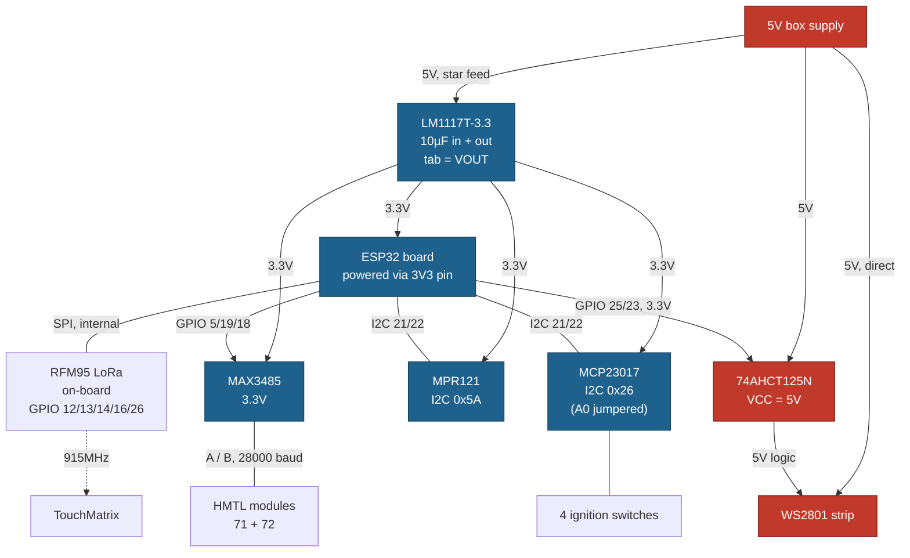

# Fire Controller — wiring guide

Single source of truth for how this box is wired. Bench procedure is in [STARTUP.md](STARTUP.md);
OTA plan in [OTA.md](OTA.md). Everything about *connections* lives here.

Board: **SparkFun ESP32 LoRa 1-CH Gateway** (ESP32-WROOM-32E, no PSRAM, on-board RFM95).

---

## 1. Parts

| Part | Identification | Key fact |
|---|---|---|
| MCU board | SparkFun ESP32 LoRa 1-CH Gateway | 7 general GPIO + I2C broken out; **no 5V input pad** |
| MCU | ESP32-WROOM-32E | no PSRAM |
| Radio | RFM95/96, on-board | consumes 12/13/14/16/26/32/33 |
| Touch | Adafruit MPR121, STEMMA QT | I2C `0x5A` |
| Switches | Waveshare MCP23017 | I2C `0x26` (A0 jumpered — 0x27 collides with the LCD); **PH2.0, not Qwiic** |
| RS485 | MAX3485 breakout | **3.3V part** — no level shifting |
| LEDs | WS2801 strip | 5V part — **needs** level shifting |
| Level shifter | SN74AHCT125N, DIP-14 | **AHCT** only; tab-less DIP |
| Regulator | LM1117T-3.3, TO-220 | **tab is VOUT, not GND** |

---

## 2. System diagram



Red = 5V domain, blue = 3.3V domain. Every ground is common.

---

## 3. Pin map

| Function      | GPIO        | Notes                                   |
| ------------- | ----------- | --------------------------------------- |
| MPR121 IRQ    | **4**       |                                         |
| I2C SDA / SCL | **21 / 22** | shared: MPR121 + MCP23017               |
| RS485 DE/RE   | **18**      | DE and RE tied together                 |
| RS485 RX ← RO | **5**       | strapping pin — safe (RO idles high)    |
| RS485 TX → DI | **19**      |                                         |
| WS2801 DATA   | **25**      | via shifter ch1                         |
| WS2801 CLOCK  | **23**      | via shifter ch2                         |

**Off limits — LoRa:** `12` MISO, `13` MOSI, `14` SCK, `16` CS, `26` DIO0, `33` DIO1, `32` DIO2.
**Leave free:** `27` — SparkFun's tutorial calls it the LoRa RST, but the header silkscreens it as a
breakout and their "7 GPIO broken out" count only works if it is free. Unresolved; the schematic in
`sparkfun/ESP32_LoRa_1Ch_Gateway/Hardware` is the authority. The map above does not need it.

**Also avoid:** 0, 2, 15 (strapping) · 1, 3 (console) · 6–11 (SPI flash) · 34–39 (input-only).

### Why these, not the PCB design's pins

The unbuilt `HMTL_ESP32_TouchController` schematic uses WS2801 on 13/14 and RS485 RX on 16 — all
LoRa pins here. `PIXELS_WS2801_25_23` already exists in `PixelUtil_config.h:179`, and the pin macros
are a hardcoded list, so choosing 25/23 keeps the LED side a build-flag change instead of a library
edit. The four switch inputs (26/27/32/33) are all LoRa and move to the MCP23017 (§7).

---

## 4. Power

**5V in. Two rails. All grounds common.**

```
                    ┌──────────────────────────────────────► 5V ─► 74AHCT125 pin 14
   5V box supply ───┤
                    ├──────────────────────────────────────► 5V ─► WS2801 strip (direct)
                    │
                    └──► LM1117T-3.3 ──► 3.3V ──┬──► ESP32 "3V3" pin
                          10µF in + out         ├──► MAX3485 VCC
                                                ├──► MPR121 (via Qwiic)
                                                └──► MCP23017 VCC

   GND ── everything: supply, regulator, ESP32, MAX3485, shifter,
          MCP23017, strip supply, RS485 bus ground
```

### ⚠ USB and the 3V3 feed must never be live together

The board has **no 5V input pad** — the only 5V entry is the USB connector (confirmed on the
board by Adam, 2026-08-17). Box power therefore
arrives regulated on the `3V3` pin, which back-drives the on-board regulator's output while that
regulator is actively driving from USB 5V.

**Calibration:** this is two sources on one rail — the same arrangement as the HMTL trigger boards,
which have run for years on an FTDI cable's 5V and their own 12V-fed regulator simultaneously with
no trouble. Linear regulators source but do not sink, so the higher one supplies the load and the
other idles. Many boards are explicitly designed to be powered via their 3V3 pin.

So this is **good practice, not a catastrophe**. Avoid it because we do not know which regulator
SparkFun fitted and unplugging one wire is free insurance — not because the board will die. Fit a
switch, or unplug the 3V3 feed before USB.

[OTA.md](OTA.md) exists to remove this hazard: with OTA there is no routine reason to attach USB.

**Alternative worth considering:** feed the box 5V *through* the USB connector on a sacrificial
cable. That uses the on-board regulator as designed, removes the back-drive hazard **mechanically**
(the port is occupied, so a second USB connection is physically impossible), and may remove the
LM1117 stage entirely. Downside: no easy console access, so it depends on OTA landing first.

### LM1117T-3.3 — four conditions

```
   TO-220, viewed from the front (marked face):

     ┌─────────┐
     │  ▓▓▓▓▓  │ ← tab = VOUT (3.3V!), NOT ground — isolate any heatsink
     │         │
     └─┬──┬──┬─┘
       │  │  └── pin 3 = VIN   (5V)
       │  └───── pin 2 = VOUT  (3.3V)
       └──────── pin 1 = GND

   10µF ──┬── pin 3 (in)        10µF ──┬── pin 2 (out)      ← BOTH required
         GND                          GND                      for stability
```

1. **Caps are mandatory.** LM1117 oscillates without an output cap; the symptom looks like random
   brownouts and resets, and you will blame firmware.
2. **Tab is VOUT.** Unlike a 7805. A heatsink bolted to a grounded enclosure shorts the 3.3V rail.
3. **Star-feed it.** ~1.2V dropout needed; 5.0−3.3 = 1.7V. Take the regulator's input from the
   supply directly, *not* downstream of the strip, or pixel current droops the rail and browns out
   the ESP32.
4. **Thermal.** Burns (5−3.3)×I ≈ 0.85W at 500mA — 50-60°C rise on a bare TO-220. Fine on the
   bench, marginal in a sealed box.

Rated 800mA; ESP32 + WiFi peaks ~500mA before LoRa TX. **A switching regulator (MP1584 / LM2596) is
the better final-build part** — no heat, no dropout margin, and OTA's WiFi load makes it tighter.

---

## 5. RS485 → HMTL modules 71 and 72

The module in hand is marked **`RS485 V2.05` / `127294G_Y1060`**. Its silkscreen reads:

```
   logic side (5 pads):   EN   VCC   RXD   TXD   GND
   bus side   (3 pads):   GND  A     B
```

**Empirically settled 2026-08-17:** with the bench wiring as built (post A/B swap), the working
UART mapping is **RX=GPIO 5, TX=GPIO 19** — verified by live polls to modules 71/72. The map
above reflects that.

**DE and RE are already tied on-board** and brought out as the single `EN` pad — no external tie
needed, unlike a bare MAX485 breakout.

```
   ESP32                 RS485 V2.05                bus
   ─────                 ───────────                ───
   GPIO 18  ───────────► EN        (= DE+RE, tied on-board)
   3V3      ───────────► VCC
   GND      ───────────► GND
   GPIO 5   ◄─────────── (module data-out)   ← UART RX, as-built and verified
   GPIO 19  ───────────► (module data-in)    ← UART TX
                                   ┌── 120Ω ──┐
                              A ───┴──────────┴─── A  ► modules 71 / 72
                              B ─────────────────── B
                            GND ─────────────────── GND  (common ground REQUIRED)
```

The module's `RXD`/`TXD` silkscreen labels were never decisive (see the caveat below); what IS
settled, by live polls, is the GPIO side: **RX=5, TX=19**. If you rewire, identify the pads by
the bench test below rather than by their names.

### ⚠ RXD/TXD naming is ambiguous — verify before trusting it

This board labels the data pins `RXD`/`TXD` rather than the chip's own `RO`/`DI`. Two conventions
exist and they are opposites:

- **"Same name to same name"** (most common on modules labelled this way): `RXD` is the receiver
  *output* (= `RO`) and goes to the ESP32's **RX**; `TXD` is the driver *input* (= `DI`) and goes to
  the ESP32's **TX**. This is what the diagram above assumes.
- **"Named from the module's point of view":** exactly reversed.

Getting it backwards is harmless to the hardware but produces total silence, which is easy to
misdiagnose as bad wiring or a dead bus.

**Decisive bench test** — power `VCC`/`GND`, hold `EN` low (receive mode), and measure:
`RO`/receiver-output is a **driven output** and idles **high (~3.3V)** with an idle bus;
`DI`/driver-input is a **high-impedance input** and will float or follow whatever you tie it to.
The pin that sits firmly at 3.3V on its own is the one that goes to the ESP32's RX (GPIO 5).

⚠ **Do this with `A`/`B` DISCONNECTED.** The fail-safe that guarantees the receiver output idles
high applies to *open* inputs. On a terminated bus with no active driver, A−B ≈ 0V through 60Ω —
inside the ±200mV undefined band — so the output is not guaranteed high and the test can float on
exactly the boards it is meant to disambiguate.

### Other notes

- **28000 baud 8N1** (`RS485Utils.h` `DEFAULT_BAUD` (line 114 pre-pull); confirmed by `RS485 setup: 28000` in the
  module boot log). Not 57600, not 115200.
- **120Ω at both physical ends only.** Check whether this board already fits one — two at one end
  is a common bench mistake.

---

## 6. I2C — MPR121 + MCP23017 + LCD backpack

All three share GPIO 21/22. Addresses are distinct by construction: MPR121 `0x5A`, MCP23017
`0x26` (A0 jumpered for exactly this), LCD backpack `0x27`.

Three bus rules with all three attached:

- **Bus speed stays at 100 kHz.** The PCF8574 LCD backpack maxes out there; the others are
  faster but the bus runs at the slowest device. The ESP32 default is already 100 kHz.
- ⚠ **The LCD backpack is the one 5V device on the bus.** Its onboard pull-ups go to ITS VCC —
  at 5V they would lift SDA/SCL above what the ESP32 (not 5V-tolerant) and the MPR121
  (abs-max ~3.6V — it dies first) survive. Preferred: a small BSS138-type bidirectional I2C
  level shifter on the LCD's leg only (LV side = bus at 3.3V, HV side = backpack at 5V).
  Acceptable-but-verify: remove the backpack's pull-up pair and let the 3.3V pull-ups win —
  the PCF8574's nominal input threshold at 5V VCC is 3.5V, so a 3.3V high is out of spec on
  paper even though it commonly works; bench-verify before trusting it.
- **Audit stacked pull-ups** once everything is attached: each breakout carries its own pair,
  and three pairs in parallel can get stiff. Aim for ~2–10 kΩ effective to 3.3V; remove pairs
  (prefer keeping the ones nearest the middle of the bus wiring) if the total drops below ~2 kΩ.

MPR121 and MCP23017 wire differently (different connectors):

```
   ESP32 Qwiic ═══════════► MPR121 STEMMA QT     (one cable: 3V3, GND, SDA, SCL)
   ESP32 GPIO 4 ◄────────── MPR121 INT

   ESP32 3V3    ──────────► MCP23017 VCC   ⚠ 3.3V, not 5V
   ESP32 GND    ──────────► MCP23017 GND
   ESP32 GPIO 21 ◄───────► MCP23017 SDA
   ESP32 GPIO 22 ─────────► MCP23017 SCL
```

- **MPR121** chains on a **Qwiic ↔ STEMMA QT** cable — identical connector, so power and I2C in one
  plug. Address `0x5A` with `ADDR` open.
- **MCP23017 is NOT Qwiic.** Waveshare uses **PH2.0 (JST-PH 2.0mm)**; Qwiic is **JST-SH 1.0mm**.
  They do not mate — use four discrete wires to the header pins.
- ⚠ **Power the MCP23017 from 3.3V.** It is "5V compatible" via a translator, but at 5V its I2C
  lines can sit at 5V and the ESP32's SDA/SCL are not 5V tolerant.
- **Address: jumper A0 closed → `0x26`.** The default (all jumpers open) is `0x27`, which
  **collides with the LCD** — the ESP32 firmware declares `LiquidCrystal_I2C lcd(0x27, ...)`.
  Short A0 and use `0x26`, and set it explicitly in firmware (the Adafruit MCP23017 library
  defaults to `0x20`, so an explicit address is needed either way).
- **Pull-ups:** both breakouts carry them; two in parallel lands ~3–5kΩ, fine at 100/400kHz.

---

## 7. Ignition switches — 12V loop → PS2501-4 optocoupler → MCP23017

The box's rocker switches are 12V-powered (built-in indicator LEDs), and the previous-generation
controller isolated them behind a **PS2501-4** quad optocoupler. That part carries over — the
isolation keeps the 12V loop (which shares a supply with solenoid hardware and its transients)
galvanically separated from the logic. Input side is unchanged from the old build; only the
output side's destination changes (MCP23017 inputs instead of AVR GPIOs).

```
   12V ── switch 1 ── R series ── PS2501 pin 1 (anode 1)     input side: ~5-10 mA
                                  PS2501 pin 2 (cathode 1) ── 12V-loop return
   (channels 2-4 identical on pins 3/4, 5/6, 7/8)

   PS2501 pin 16 (collector 1) ──► MCP23017 GPA0      output side, per channel:
   PS2501 pin 15 (emitter 1)   ──► logic GND          collector → GPAn (internal 100k
   (channels 2-4: 14/13, 12/11, 10/9)                 pull-up enabled), emitter → GND
```

- **Active-low, same as before:** switch closed → opto conducts → GPAn pulled low. This matches
  the firmware's seen-open interlock convention; no logic inversion anywhere.
- **Series resistors:** reuse the old assembly's if they come with the harness; otherwise
  ~1.5–2.2 kΩ for 5–10 mA through the opto LED at 12V.
- The 12V-loop side and the logic side share **no** wiring except inside the opto. That is the
  point — do not "simplify" by commoning their grounds at the switch panel.
- MCP23017 internal pull-ups (~100 kΩ) are sufficient here — the opto only has to sink ~33 µA,
  and the noise argument for stiffer external pull-ups is weakened by the isolation. If a channel
  looks slow or noisy on the bench, 10 kΩ external pull-ups are the fallback.

**Interrupts:** `INTA`/`INTB` are broken out but there is no free GPIO. Either poll on a timer
(fine at human timescales), or set `INT` open-drain (`IOCON.ODR`) and **wire-OR it onto GPIO 4**
next to the MPR121's IRQ, which is already open-drain active-low, then poll both chips when it
asserts.

### ⚠⚠ Scope warning: this covers the INPUT side only

What follows is about reading the switches safely. **It is not a safety case for the system.** The
actuation side — what actually opens fuel and fires igniters — is not addressed anywhere in these
documents. At minimum the following must be decided before anything is connected to gas:

1. **A hardware E-stop.** A physical means of removing power from solenoids/igniters that does not
   depend on the ESP32, the I2C bus, firmware, or any software state. Nothing in this design
   provides one. That is the largest gap in this document set.
2. **Loss-of-comms fail-safe at the actuators.** Ignition is executed by trigger boards 71/72 over
   RS485, not by this controller directly. If the controller browns out, hangs, or the bus dies
   mid-sequence, **do 71/72 time out and close?** Unverified. The usual answer is a heartbeat with
   an actuator-side timeout; without one, a hung master leaves valves as last commanded.
3. **WiFi/AP exposure.** The WiFi build runs its web server in a FreeRTOS task pinned to core 0
   — the flame path in `loop()` (core 1) never services HTTP, so a stalled or adversarial client
   can wedge the *API* but not flame-off. The server task only reads a status snapshot published
   by `loop()`; nothing HTTP-reachable writes ignition state. AP fallback is **enabled by
   decision** (2026-08-18): with no known network the controller raises a **WPA2
   password-protected** AP (never open — a sub-8-char password is refused rather than falling
   open, and with no flashed password a stable per-device one is derived and printed on serial).
   The AP's name and initial password can both be fixed at build time
   (`-DFC_WIFI_AP_SSID`/`-DFC_WIFI_AP_PASS`, API.md §3), which is how a deployed board gets
   credentials the crew knows in advance without a serial capture in the field.
   Endpoints that change WiFi state or list stored networks (`/network`, `/scan`, `/known`)
   require HTTP Basic auth with that password; the WiFiManager captive portal is not used.
   Residual exposure to accept knowingly: whoever holds the AP password can repoint the
   controller's WiFi (not ignition), and an adversarial client can deny the status API.
   Operator-facing usage — endpoints, auth, `curl` examples, the join flow — is in
   [API.md](API.md).

The rules below are necessary, not sufficient.

### ⚠ Fail-safe requirement — switch inputs

These switches drive the flame-effect ignition sequence. Behind I2C they gain a failure mode they
do not have on direct GPIO: a bus lockup makes switch state **unreadable**.

Note the MCP23017's internal pull-ups are ~100kΩ — weak for switch wiring in a box with solenoid
and RF noise. Consider external 4.7–10kΩ pull-ups plus debounce rather than relying on the
internal ones.

1. **A failed or timed-out read must read as "off / not armed."** Never last-known-state, never a
   default of armed. This is the single most important rule here.
2. **Bus recovery + watchdog:** detect the timeout, clock out 9 bits to free a stuck slave, hold
   outputs safe until clean reads resume.
3. **Consider master-arm on a direct GPIO.** `27` is the only candidate — a concrete reason to
   settle the GPIO 27 question. An arm/kill that does not depend on a healthy bus is safer.

---

## 8. WS2801 through the 74AHCT125N

WS2801 is a 5V part; its logic-high threshold is commonly quoted as 0.7–0.8 × VDD, i.e. **3.5–4.0V**
at 5V (check the datasheet for your strip), and the ESP32 drives 3.3V.
Out of spec — works on a short bench lead, then fails with a longer strip or a warm day.

```
                 SN74AHCT125N (DIP-14)
                  ┌──────∪──────┐
   GND ──────────►│1 (1OE#) VCC│◄────── +5V ──┬── 100nF ──┐
   GPIO 25 ──────►│2 (1A)  4OE#│              │           │
   WS2801 DATA ◄──│3 (1Y)    4A│──► GND      (close       │
   GND ──────────►│4 (2OE#)  4Y│              to chip)    │
   GPIO 23 ──────►│5 (2A)  3OE#│◄── VCC                   │
   (4OE# pin 13 ─────────────────────► VCC — hold ch4 off)
   WS2801 CLK  ◄──│6 (2Y)    3A│──► GND                   │
   GND ──────────►│7 (GND)   3Y│──► GND                   │
                  └─────────────┘                         │
                     └── GND ───────────────────────────--┘
```

- **AHCT only.** HCT/AHCT have TTL input thresholds (V_IH ≈ 2.0V) so 3.3V is a solid high. Plain
  `HC`/`AHC` use 0.7×VCC and reproduce the exact problem.
- **Never a BSS138 bidirectional module** — those are for I2C, too slow for a clocked pixel bus,
  and produce intermittent corruption that looks like a firmware bug.
- **VCC must be the strip's 5V rail** — that is what sets the output swing.
- **Tie unused inputs** (pins 9, 12) to GND so they do not float; hold their outputs off with
  OE# (pins 10, 13) to VCC.
- Matches the PCB design, which specifies `74AHCT125D` + 100nF as U7/C12
  (`generate_schematic.py:1004-1036`) — that board is unbuilt, so this is design intent, not a
  validated reference.

---

## 9. LoRa

Nothing to wire — the RFM95 is on-board. **Fit an antenna to the uFL connector or whip pad before
transmitting**; running the PA into no load can damage it.

915MHz, so no conflict with 2.4GHz WiFi.

⚠ **No LoRa firmware exists.** `DISABLE_LORA` is a build flag with nothing behind it, and
ArduinoLibs has no RFM95 driver — a `LoRaSocket` must be written, modelled on `RFM69Socket`. That
file also fails to compile on ESP32 (`RFM69Socket.cpp:27-33`, `#error Unknown processor type`;
ESP32 needs `digitalPinToInterrupt()`).

---

## 10. Switch-chain integration tests (run when the optos + MCP23017 go in)

Unpowered (continuity):
- [ ] Per channel: 12V switch feed → series R → opto anode; opto cathode → 12V-loop return.
- [ ] Per channel: opto collector → its GPAn pin; all four emitters → logic GND.
- [ ] **No** continuity between the 12V-loop return and logic GND (the isolation is the test).

Powered, before firmware trusts it:
- [ ] I2C scan shows exactly `0x26` (MCP23017), `0x27` (LCD, if attached), `0x5A` (MPR121).
- [ ] SDA/SCL idle HIGH at **3.3V** (not 5V!) with all devices attached — catches the LCD
      pull-up hazard from §6. Measure before connecting the ESP32 if the LCD is new to the bus.
- [ ] Per channel: switch open → GPAn reads high (≥3.0V at the pin); switch closed → GPAn
      **< 0.4V** (also screens an aged opto's CTR; a channel sagging near 1V is a tired part).
- [ ] Firmware pass: with the interlock reset, each switch must read open ≥1s before a close
      registers (`SWITCH_OPEN_LATCH_MS` qualification — same behavior as the native tests).
- [ ] Wiggle test per channel at the switch panel: no cross-channel chatter on the other GPAn
      bits (screens harness crosstalk into the 12V loop).

## 11. Pre-power checklist

- [ ] USB **not** connected if the 3V3 feed is live
- [ ] LM1117: 10µF on input *and* output; tab (VOUT) isolated; star-fed from the supply
- [ ] MCP23017 on **3.3V**, not 5V
- [ ] 74AHCT125 pin 1 at the notch; VCC on the strip's 5V; 100nF fitted
- [ ] No 5V on any ESP32 GPIO — only shifter VCC, shifter outputs (pins 3/6), strip
- [ ] All grounds common
- [ ] MAX3485 A/B not swapped; 120Ω at both bus ends only
- [ ] Strip powered directly from the supply, not through the board or breadboard rails
- [ ] LoRa antenna fitted before any transmit

## Bill of materials

| Item | Note |
|---|---|
| SparkFun ESP32 LoRa 1-CH Gateway | have |
| Adafruit MPR121 (STEMMA QT) | have |
| Waveshare MCP23017 | ordered — PH2.0, needs 4 wires |
| MAX3485 breakout | have |
| SN74AHCT125N, DIP-14 | ordered — AHCT, not HC/AHC |
| LM1117T-3.3, TO-220 | have — consider a buck for the final build |
| 10µF electrolytic/tantalum ×2 | LM1117 in + out, **required** |
| 100nF ceramic | shifter bypass |
| Qwiic ↔ STEMMA QT cable | ESP32 ↔ MPR121 |
| 120Ω ×2 | RS485 termination — may be on the breakouts |
| 5V supply | sized for the strip |
| LoRa antenna | uFL or whip |
